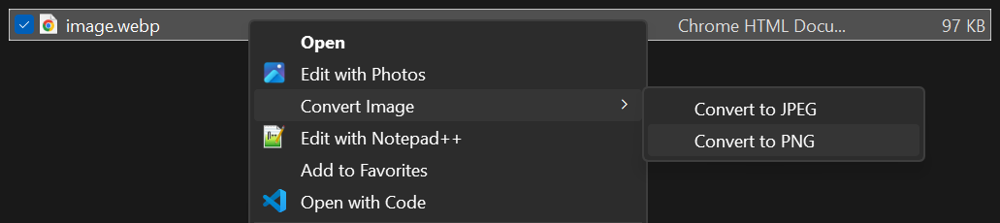
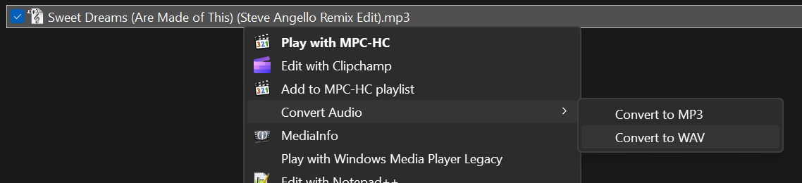
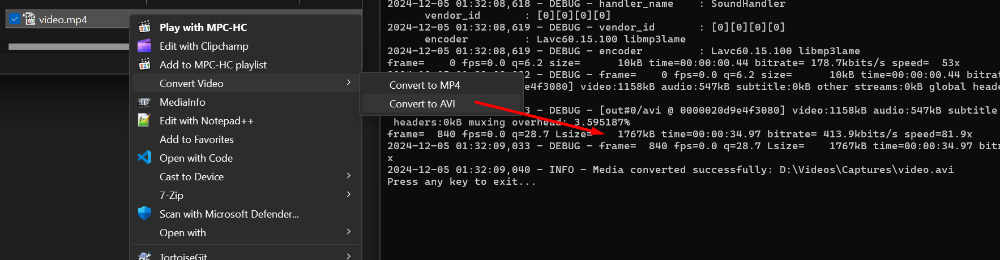

# **Media Converter with Context Menu Integration**

A handy Python application that allows you to convert images, audio, and video files to various formats directly from the file explorer. Simply right-click on a media file, select the desired conversion option, and the conversion happens instantly.

Convert your media files directly from the context menu:





The CMD window provides real-time feedback during video/audio conversions:



## **Features**

- **Seamless Integration**: Integrates into the Windows 10/11 context menu for quick access.
- **Image Conversion**: Convert images to JPEG or PNG formats.
- **Audio Conversion**: Convert audio files to MP3 or WAV formats.
- **Video Conversion**: Convert videos to MP4 or AVI formats.
- **Silent Operation**: Executes conversions without cluttering your screen with command windows.
- **Logging**: Detailed logs are stored in the user's home directory for auditing and debugging.
- **Easy Setup and Removal**: Simple batch scripts to install and uninstall the context menu entries.

## **Prerequisites**

- **Python 3.6 or higher**: Ensure Python is installed and added to your system `PATH`.
- **`pip` Package Manager**: Comes with Python installations.
- **`ffmpeg`**: Download and install from [ffmpeg.org](https://ffmpeg.org/), and add it to your system `PATH`.

## **Installation**

1. **Clone the Repository:**

   ```bash
   git clone https://github.com/tornellihenrique/media-converter.git
   ```

2. **Navigate to the Project Directory:**

   ```bash
   cd media-converteer
   ```

3. **Install Dependencies:**

   ```bash
   pip install -r requirements.txt
   ```

   **Note**: If you encounter permissions issues, you may need to run the command as an administrator or use a virtual environment.

4. **Install `ffmpeg`:**

   - Download from [ffmpeg.org](https://ffmpeg.org/download.html).
   - Add the `ffmpeg/bin` folder to your system `PATH`.

5. **Set Up Context Menu Integration:**

   - Right-click on `setup_registry.bat` and select **Run as administrator**.
   - Confirm any prompts to allow the script to modify the registry.

## **Usage**

### **Converting Files**

1. **Right-Click on a Media File**: Supported file types are listed below.
2. **Select Conversion Option**:
   - For images: **Convert Image > Convert to JPEG/PNG**.
   - For audio: **Convert Audio > Convert to MP3/WAV**.
   - For video: **Convert Video > Convert to MP4/AVI**.
3. **Wait for Conversion**:
   - A CMD window will appear showing the conversion progress.
   - After completion, press any key to exit the CMD window.
4. **Find Your Converted File**:
   - The converted file will be in the same directory as the original file.

### **Supported File Types**

- **Images**: `.jpg`, `.jpeg`, `.png`, `.bmp`, `.tiff`
- **Audio**: `.mp3`, `.wav`, `.ogg`, `.flac`, `.aac`
- **Video**: `.mp4`, `.avi`, `.mkv`, `.mov`

### **Logs**

- Conversion logs are stored in `convert_media.log` in your home directory (`C:\Users\YourUsername\convert_media.log`).

## **Project Structure**

```
media-converter/
│
├── convert_media.py           # Python script for handling conversions
├── requirements.txt           # Python dependencies
├── setup_registry.bat         # Batch script to add registry entries
├── remove_registry.bat        # Batch script to remove registry entries
├── README.md                  # Project documentation
└── LICENSE                    # License file
```

## **Contributing**

Contributions are welcome! Please open an issue or submit a pull request for any improvements.

## **License**

This project is licensed under the MIT License - see the [LICENSE](LICENSE) file for details.

## **Acknowledgments**

- **[Pillow](https://python-pillow.org/)**: For image processing.
- **[FFmpeg](https://ffmpeg.org/)**: For audio and video conversions.